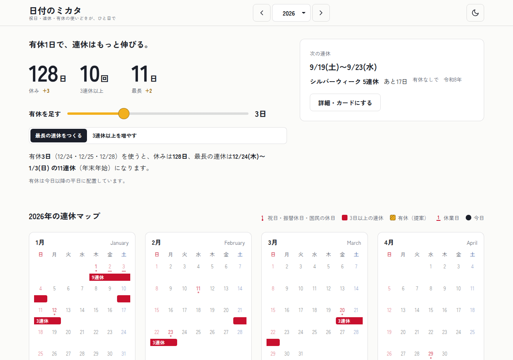
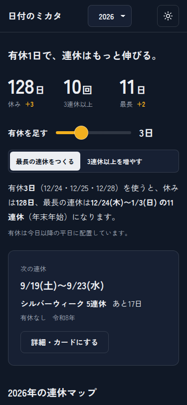
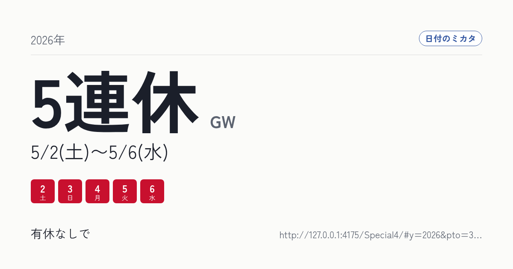
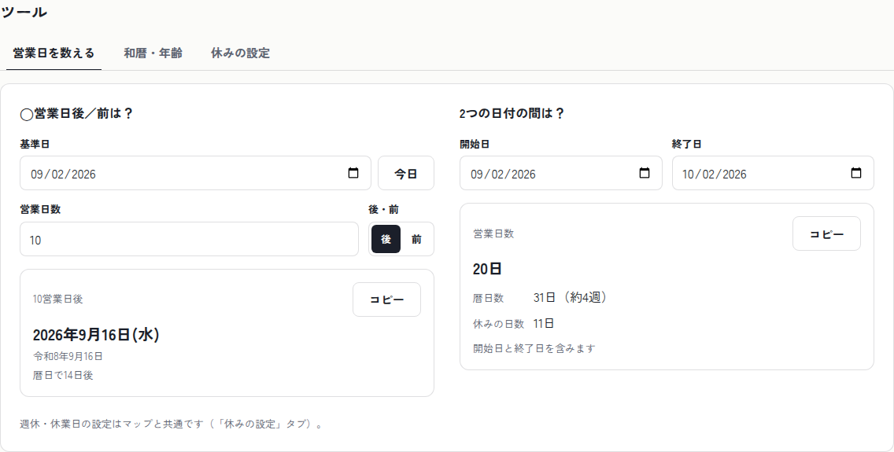

# 日付のミカタ — 有休1日で、連休はもっと伸びる。

日本の「国民の祝日に関する法律」をブラウザーの中だけで計算し、その年の祝日と連休を一枚の**年間連休マップ**にするデモアプリです。有休スライダーを動かすと、連休がどこまで伸びるかが見出しの数字とリボンに即座に映ります。営業日計算・和暦変換の小道具も同じ画面に揃えました。

**公開URL:** https://benriworks.github.io/Special4/

外部との通信はゼロ。初回表示のあとはオフラインでも動きます（PWA）。



## できること

- **年間連休マップ** — 12か月を一画面に。祝日・振替休日・国民の休日・週休・休業日を色と記号で区別し、3日以上の休みを「連休リボン」として名前（GW／シルバーウィーク／年末年始／お盆）と日数つきで重ねます。
- **有休ブースト** — 有休を0〜10日足すと、「最長の連休をつくる」「3連休以上を増やす」の2方針で最適な配置を提案。今年を表示中は今日以降の平日にだけ置きます。休み合計・3連休以上の回数・最長日数が数字ロールで変わります。
- **連休カード** — リボンを選ぶと詳細シート。1200×630のPNG（Canvas 2D）を生成して保存・共有（Web Share API）・テキストコピーができ、URLハッシュで同じ表示を再現できます。
- **営業日を数える** — 「10営業日後はいつ？」「2つの日付の間は何営業日？」。週休・休業日の設定と連動。
- **和暦・年齢** — 西暦⇔和暦（明治6年〜）、満年齢・数え年・干支・次の誕生日まで。
- **休みの設定** — 週休（土日／日曜のみ／なし）と毎年の休業日（年末年始・お盆のプリセット、任意期間）。ブラウザーに保存され、URLにも反映されます。
- **ライト／ダーク**、キーボード操作（マップは矢印キーで移動）、`prefers-reduced-motion` 対応、375px〜1280px対応。

| モバイル（ダーク） | 連休カード | ツール |
|---|---|---|
|  |  |  |

## GitHub Pages で公開する

1. リポジトリの **Settings → Pages → Build and deployment → Source** を **GitHub Actions** にする（初回のみ）。
2. `main` にプッシュ（マージ）する。または Actions タブの「Deploy to GitHub Pages」を **Run workflow** で手動実行する。
3. 1分ほどで https://benriworks.github.io/Special4/ で公開されます。

> **画面が真っ白になるとき**: Source が「**Deploy from a branch**」のままです。その設定では GitHub 標準の「pages build and deployment」が `main` のソース（ビルド前の `index.html`）をそのまま配信し、こちらのワークフローの結果を上書きしてしまいます。Source を「GitHub Actions」に切り替えると標準ビルドは止まり、以後は `dist/` だけが配信されます。切り替え前でも「Deploy to GitHub Pages」を手動実行すれば、次に `main` へプッシュするまでは正しく表示されます。

ワークフローは [`.github/workflows/deploy.yml`](.github/workflows/deploy.yml)。`npm ci && npm run build` の成果物 `dist/` を `actions/deploy-pages` で配信します。Vite の `base` は `/Special4/` に固定してあります（リポジトリ名を変えたら `vite.config.ts` の `BASE` と、`index.html` の `og:url` / `og:image` も変更してください）。

## 正確さについて

- 祝日は `src/core/holidays/rules.ts` に法律の条文どおり宣言的に定義（年範囲つき）。振替休日は1973年4月12日以降、2007年以降の連鎖ルール、国民の休日は1985年12月27日以降と2007年改正を実装。
- 2019年の即位関連、2020・2021年の五輪特例、1959・1989・1990・1993年の一回限りの休日を `YEAR_OVERRIDES` で扱います。
- 春分の日・秋分の日は広く使われる近似式（1900〜2099年）で算出し、官報公示前の年は「予定」と表示します。
- 単体テストで **内閣府公表の2015〜2026年の祝日一覧と全一致**することを確認しています（`src/core/holidays/__tests__/`）。
- 対応年: マップ 1970〜2050年、和暦 1873年（明治6年）〜2099年。

## 技術

| 領域 | 採用 |
|---|---|
| UI | React 19 / TypeScript 7 / Vite 8 |
| ロジック | 純関数ライブラリ（`src/core/`）。依存ゼロ、Vitest で134テスト |
| E2E | Playwright（`tests/`、28件）— 実際の `/Special4/` サブパスで起動して検証 |
| PWA | vite-plugin-pwa（precache・更新トースト） |
| フォント | Zen Kaku Gothic New（SIL OFL）を使用文字だけにサブセット化して自前配信（フォント約190KB、アプリ全体で約600KB） |
| 状態 | URL ハッシュ（`#y=2026&pto=3&mode=longest&wk=sat-sun&off=…`）と localStorage の双方向同期 |
| デザイン | [`docs/DESIGN_SPEC.md`](docs/DESIGN_SPEC.md) の14観点で確定したトークンのみを使用（`src/styles/tokens.css`） |

### 構成

```
src/
  core/holidays   祝日・休日ビットマップ・連休検出・営業日
  core/pto        有休の最適配置（最長／3連休以上）
  core/jpdate     和暦・年齢・干支・日本語書式
  features/yearmap ヒーロー・12か月グリッド・リボン・詳細シート
  features/tools   営業日／和暦・年齢／休みの設定
  features/share   連休カード（Canvas）と共有
  app/             シェル・状態・テーマ・PWA
scripts/           フォントサブセット化・アイコン生成・スクリーンショット
```

## 開発

```bash
npm ci
npm run dev            # http://localhost:5173/Special4/
npm run test:unit      # Vitest
npx playwright install chromium   # 初回のみ（E2E・アイコン生成・スクリーンショット用）
npm test               # ビルド + Playwright E2E
npm run build && npm run preview
npm run fonts:subset   # UI文字列を変えたら再実行（要 python3 + pip install fonttools brotli）
node scripts/gen-icons.mjs        # アイコン・OG画像
node scripts/screenshots.mjs      # 全体スクリーンショット
```

## 注記

- このアプリはデモです。実際の予定は公式の情報でご確認ください。
- 想定ターゲット（日本在住の会社員・フリーランス・総務担当）は設計時の推定です。詳細は `docs/DESIGN_SPEC.md` §1。
- フォント: Zen Kaku Gothic New © Yoshimichi Ohira, SIL Open Font License 1.1。
